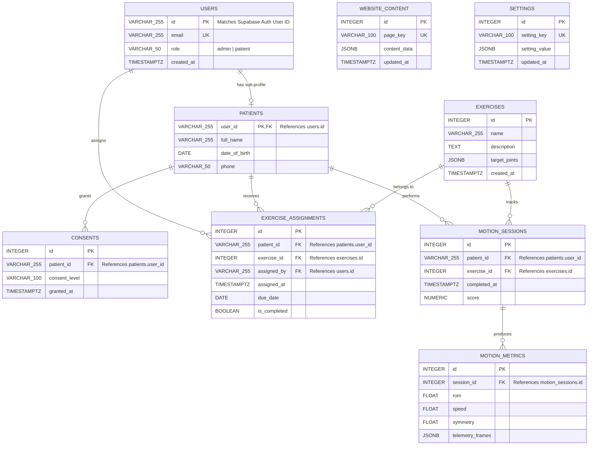

# Chosen Motion - Entity Relationship Diagram

This document contains the Entity Relationship (ER) diagram for the PostgreSQL database schema of Chosen Motion.

```mermaid
erDiagram
    USERS {
        VARCHAR_255 id PK "Matches Supabase Auth User ID"
        VARCHAR_255 email UK
        VARCHAR_50 role "admin | patient"
        TIMESTAMPTZ created_at
    }

    PATIENTS {
        VARCHAR_255 user_id PK, FK "References users.id"
        VARCHAR_255 full_name
        DATE date_of_birth
        VARCHAR_50 phone
    }

    CONSENTS {
        INTEGER id PK
        VARCHAR_255 patient_id FK "References patients.user_id"
        VARCHAR_100 consent_level
        TIMESTAMPTZ granted_at
    }

    EXERCISES {
        INTEGER id PK
        VARCHAR_255 name
        TEXT description
        JSONB target_joints
        TIMESTAMPTZ created_at
    }

    EXERCISE_ASSIGNMENTS {
        INTEGER id PK
        VARCHAR_255 patient_id FK "References patients.user_id"
        INTEGER exercise_id FK "References exercises.id"
        VARCHAR_255 assigned_by FK "References users.id"
        TIMESTAMPTZ assigned_at
        DATE due_date
        BOOLEAN is_completed
    }

    MOTION_SESSIONS {
        INTEGER id PK
        VARCHAR_255 patient_id FK "References patients.user_id"
        INTEGER exercise_id FK "References exercises.id"
        TIMESTAMPTZ completed_at
        NUMERIC score
    }

    MOTION_METRICS {
        INTEGER id PK
        INTEGER session_id FK "References motion_sessions.id"
        FLOAT rom
        FLOAT speed
        FLOAT symmetry
        JSONB telemetry_frames
    }

    WEBSITE_CONTENT {
        INTEGER id PK
        VARCHAR_100 page_key UK
        JSONB content_data
        TIMESTAMPTZ updated_at
    }

    SETTINGS {
        INTEGER id PK
        VARCHAR_100 setting_key UK
        JSONB setting_value
        TIMESTAMPTZ updated_at
    }

    %% Relationships
    USERS ||--o| PATIENTS : "has sub-profile"
    USERS ||--o{ EXERCISE_ASSIGNMENTS : "assigns"
    PATIENTS ||--o{ CONSENTS : "grants"
    PATIENTS ||--o{ EXERCISE_ASSIGNMENTS : "receives"
    PATIENTS ||--o{ MOTION_SESSIONS : "performs"
    EXERCISES ||--o{ EXERCISE_ASSIGNMENTS : "belongs to"
    EXERCISES ||--o{ MOTION_SESSIONS : "tracks"
    MOTION_SESSIONS ||--o{ MOTION_METRICS : "produces"
```
